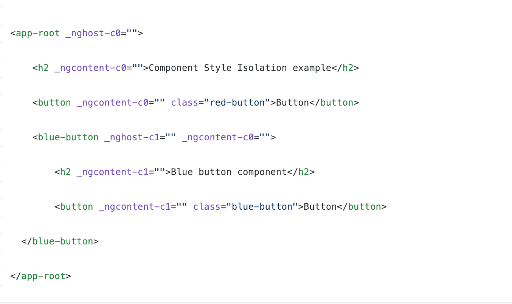
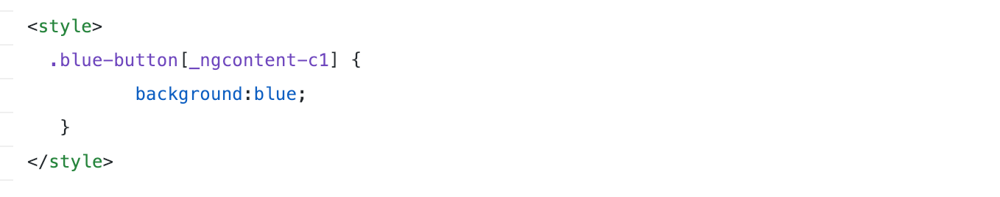

export { bytexTheme as theme, Provider  } from './theme'
import { CodeSurfer } from "mdx-deck-code-surfer"
import { Image } from 'mdx-deck'

### FII Practic Session 2

---

### `Lifecycle Hooks`
Angular offers lifecycle hooks that provide visibility into these key life moments and the ability to act when they occur.

---

### Hooks and Sequence
`ngOnChanges()`, `ngOnInit()`, `ngDoCheck()`, `ngAfterContentInit()`, `ngAfterContentChecked()`, `ngAfterViewInit()`, `ngAfterViewChecked()`, `ngOnDestroy()`

---
<CodeSurfer
title="Hooks Component"
dark="true"
code={require("raw-loader!./src/app/demos/life-cycle-hooks.ts")}
steps={[
  {range: [17, 22], notes: "Hooks implementation."},
  {range: [31, 36], notes: "OnChanges"},
  {range: [36, 41], notes: "ngOnInit"},
  {range: [41, 59], notes: "All others"},
  {range: [57, 59], notes: "OnDestroy"},
]}
/>

---
<CodeSurfer
title="AfterViewInit Component"
dark="true"
code={require("raw-loader!./src/app/demos/after-view-init.ts")}
steps={[
  {range: [37, 53], notes: "AfterViewInit hook."}
]}
/>

---
### Component Interaction
Pass data from parent to child with input binding.
Use ``@Input decorator``.

---
### Component Interaction
Parent listens for child event.
Use ``@Output decorator``.

---
<CodeSurfer
title="Component Interaction"
dark="true"
code={require("raw-loader!./src/app/demos/after-view-init.ts")}
steps={[
  {range: [18, 28], notes: "Input, Output and 2 more."},
  {range: [27, 37], notes: "ViewChild and local variable"}
]}
/>

---
<CodeSurfer
title="Parent and children communicate via a service."
dark="true"
code={require("raw-loader!./src/app/demos/component-interaction.service.ts")}
/>

---
<CodeSurfer
title="Component that subscribes."
dark="true"
code={require("raw-loader!./src/app/demos/component-interaction.ts")}
/>

---
### Component Styles
The styles specified in @Component metadata apply only within the template of that component.

---
Changes to styles elsewhere in the application don't affect the component's styles.

---
You can co-locate the CSS code of each component with the TypeScript and HTML code of the component, which leads to a neat and tidy project structure.

---
You can change or remove component CSS code without searching through the whole application to find where else the code is used.

---
How ?

---

---

---

# `Va multumesc`
